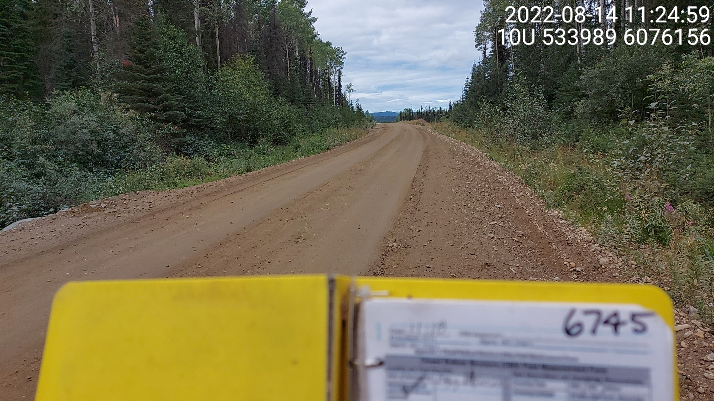
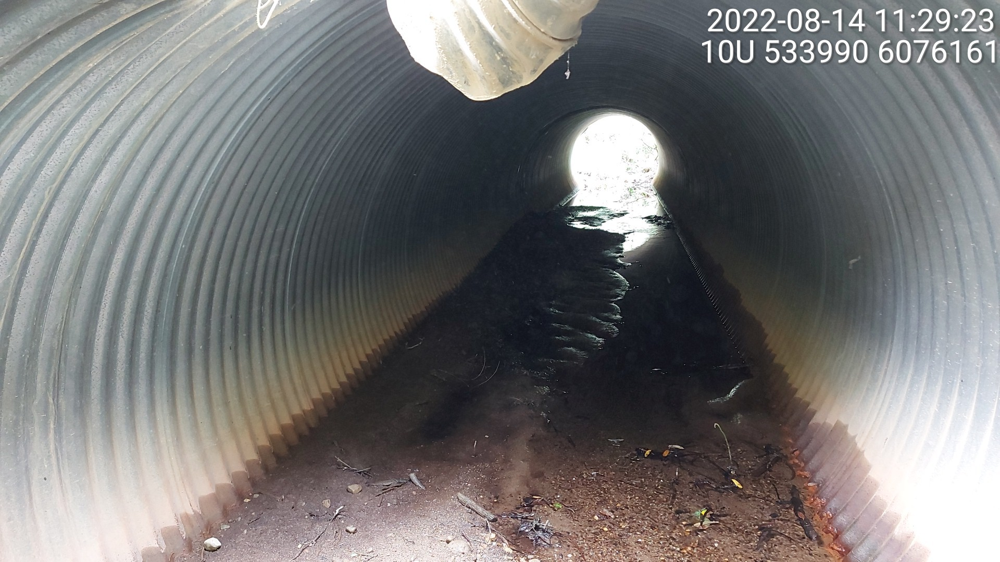

# Background


## Project Location

Here is how we insert a figure and we can reference it like this - Figure \@ref(fig:overview-map). The caption is in the 
chunk header as `fig.cap`.

```{r overview-map, fig.cap = 'Overview map of Study Areas',eval=T}

```

<br>

Here is how we do multiple figures in one chunk - side by each (like toasts). We reference it like this -
Figure \@ref(fig:fig-multi).

```{r fig-multi, fig.cap = 'Multiple figures or photos side by each.', fig.show="hold", out.width= c("49.5%","1%","49.5%")}

knitr::include_graphics("fig/pixel.png")

```

<br>

Here is how we conditionally include chunk output based on the `params$gitbook_on` parameter. If this is the gitbook version, 
the image will NOT be included. If this is the pdf version, this double image will not be included.  We do this to make the pdf version read nicely and not be a million pages long due to individual photos taking up a half a page each.


```{r fig-multi-conditional, fig.cap = 'Multiple figures or photos side by each.  Turned on conditionally with the eval parameter in the rmarkdown chunk to run only when the pdf version of the document is built.', fig.show="hold", out.width= c("49.5%","1%","49.5%"), eval=identical(params$gitbook_on, FALSE)}

knitr::include_graphics("fig/pixel.png")

```

<br>

Let's add a reference here so that we can test if our system of pulling from Zotero as per https://github.com/NewGraphEnvironment/mybookdown-template/issues/49
is going to work @bramblett_etal2002SeasonalUse
`r if(params$gitbook_on){knitr::asis_output("<br>")} else knitr::asis_output("<br><br><br><br>")`


