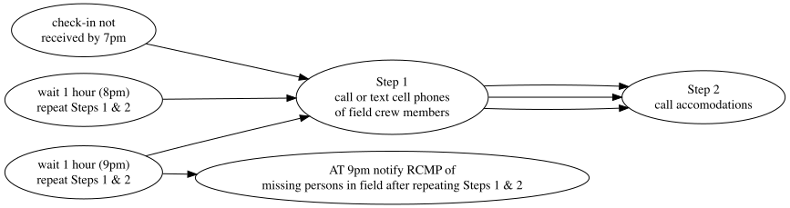

{.logo} 


 

<br>

::: from
Al Irvine  
New Graph Environment Ltd.  
al@newgraphenvironment   
250-777-1518  
Date Original: 2024-08-09  
Date Revised: `r format(Sys.Date(), "%Y-%m-%d")` 
:::


<br>


```{r setup, include = TRUE, echo =FALSE, message=FALSE, warning=FALSE}
# gitbook_on <- TRUE
gitbook_on <- FALSE  ##we just need turn  this on and off to switch between gitbook and pdf via paged.js


knitr::opts_chunk$set(echo=FALSE, message=FALSE, warning=FALSE, dpi=60, out.width = "100%")
options(scipen=999)
options(knitr.kable.NA = '--') #'--'
options(knitr.kable.NAN = '--')

source('scripts/packages.R')
source('scripts/staticimports.R')
source('scripts/functions.R')

name_project_number <- '2024-073'
name_project_name <- 'sern-peace-fish-passage'
name_repo <- 'safety_plan_peace_2024'
name_pdf <- 'safety_plan'
name_project_complete <- paste0(name_project_number, '-', name_project_name)

link_repo <- paste0('https://newgraphenvironment.github.io/', name_repo, '/')
link_kml <- paste0('https://github.com/NewGraphEnvironment/', name_repo, '/raw/main/mapping/sites_', name_project_name, '_', format(Sys.Date(), '%Y%m%d'), '_kml_gpx.zip')
link_pdf <- paste0('https://github.com/NewGraphEnvironment/', name_repo, '/raw/main/docs/', name_pdf, '_', name_project_name, '.pdf')
link_fieldmaps <- 'https://hillcrestgeo.ca/outgoing/fishpassage/projects/parsnip/'

## NEED TO UPDATE ACCOMODATIONS
hotel1 <- "NEED TO UPDATE"
hotel2 <- "NEED TO UPDATE"

vehicle1 <- '2013 Toyota Tundra black w/flatdeck and yellow can-am quad'
vehicle2 <- '2006 Pontiac Vibe red'
```
```{r info-hospitals}
hospital_name <- 'University Hospital of Northern British Columbia'
hospital_phone <- '250-565-2000'
hospital_address <- '1475 Edmonton St., Prince George, BC V2M 1S2'

```

```{r import-projects}
##Read in the contacts spreadsheet
####--------------bring in the equipment list and crew info-----------------
projects <-  readxl::excel_sheets(path = "../onboarding/data/equipment_contacts_safetylog.xlsx") %>%
  purrr::set_names() %>%
  purrr::map(readxl::read_excel,
             path = "../onboarding/data/equipment_contacts_safetylog.xlsx",
             .name_repair = janitor::make_clean_names) %>%
  purrr::set_names(janitor::make_clean_names(names(.))) %>%
  purrr::map(at_trim_xlsheet) %>% #this is the clean run of this function
  purrr::map(plyr::colwise(type.convert))

```

```{r  tab-overview, eval= F}
# turned eval = off!!!!

## I think we could probably remove this, doesn't to be used for anything and turned off...
tab_overview <- projects %>% 
  pluck('projects') %>% 
  filter(`project` == name_project_complete) %>% 
  select(`project`)

tab_overview %>% 
  kable() %>% 
  kableExtra::kable_styling(c("condensed", "responsive"),
                              full_width = T,
                              font_size = font_set)
```

```{r settings-gitbook, eval= gitbook_on}
photo_width <- "100%"
font_set <- 11

```

```{r settings-paged-html, eval= identical(gitbook_on, FALSE)}
photo_width <- "80%"
font_set <- 8
```


<br>

# `r paste0('Safety Plan - ',name_project_complete)` {.unnumbered .break-after-me}

The latest version of this pdf can be downloaded [here](`r knitr::asis_output(link_pdf)`).


<br>

The main goal of the fieldwork is baseline monitoring using electrofishing with crews from McLeod Lake. We will be at the six permitted electrofishing sites most of the time.  In addition we may spend some time with fish passage (Phase 1) and Phase 2 (Habitat Confirmation) assessments in areas of not only the Parsnip watershed group but also the Carp and Crooked watershed groups. A summary of the electrofishing sites to be potentially assessed is included as Table \@ref(tab:tab-electrofishing-sites). A summary of new assessment sites for fish passage assessment and habitat confirmation to be potentially assessed is included as Table \@ref(tab:tab-priority-sites) with a kml (google earth) and gpx (garmin) file downloadable [here](`r knitr::asis_output(link_kml)`). 

<br>

Georeferenced pdf maps can be accessed and downloaded [here](`r knitr::asis_output(link_fieldmaps)`).

<br>

## New Graph Employee Information {.unnumbered}

Al Irvine  
Vehicle:  `r vehicle1`  
Accommodation: `r hotel2`  

<br>

Lucy Schick     
Vehicle:  `r vehicle2`  
Accommodation: `r hotel2  `


<br>

## Crew Members {.unnumbered}

New Graph Employees Al Irvine and Lucy Schick will be joined by crews from McLoed Lake. All crew member information and emergency contacts can be found below.

<br>

```{r tab-crew}
crew_ids <- c('airvine', 
              'lschick', 
              'nprince', 
              'espence',
              'eisadore',
              'tsalonas',
              'bprince',
              'jdemont')


tab_crew <- projects %>% 
  pluck('crew_contacts')  %>% 
  filter(id %in% crew_ids) %>% 
  select(-id) %>% 
  purrr::set_names(nm = names(.) %>% stringr::str_replace_all('crew_', ''))


tab_crew %>% 
  kable(caption = 'Crew members details and emergency contacts') %>% 
  kableExtra::kable_styling(c("condensed", "responsive"),
                              full_width = T,
                              font_size = font_set)
```

<br>

## Equipment Checklists {.unnumbered}

```{r table-equipment}

## personal equipment 

tab_eq_pers <-  readr::read_csv(
  url(("https://raw.githubusercontent.com/NewGraphEnvironment/new_graphiti/main/assets/data/equipment.csv")
  ))|> 
  filter(!is.na(eq_pers_standard)) %>% 
  arrange(eq_safety) %>% ##have these first on the list
  select(eq_item)  %>% 
  make_untidy_table() %>% 
  rename(`Personal Equipment Checklist` = eq_item)

my_caption = 'Personal Equipment Checklist'

tab_eq_pers %>% 
  kable() %>% 
  kableExtra::kable_styling(c("condensed", "responsive"),
                              full_width = T,
                              font_size = font_set)
```

<br>

```{r equip_crew}

##equipment for the crew
tab_eq_pers <-  readr::read_csv(
  url(("https://raw.githubusercontent.com/NewGraphEnvironment/new_graphiti/main/assets/data/equipment.csv")
  ))|>
  filter(if_any(starts_with('eq_task'), ~ . == 'fish passage')) %>% 
  filter(is.na(eq_pers_standard)) %>% 
  arrange(eq_safety) %>% 
  select(eq_item)  %>% 
  make_untidy_table() %>% 
  rename(`Crew Equipment Checklist` = eq_item)

my_caption = 'Crew Equipment Checklist'

tab_eq_crew %>% 
  kable() %>% 
  kableExtra::kable_styling(c("condensed", "responsive"),
                              full_width = T,
                              font_size = font_set)

```

<br><br>

## Nearest Hospitals {.unnumbered}

```{r hospital-1, fig.cap=my_caption, fig.width=6}
my_caption = paste(hospital_name, hospital_address, hospital_phone, sep = ' - ')

##register google key defined in 'R/private_info.R' file
ggmap::register_google(key = Sys.getenv('GOOG_API_KEY'))

#define the area of the base map by using a bounding box 
mybasemap <- ggmap::get_map(location = hospital_address,
                     source = "google",
                     zoom = 16,
                    maptype = "roadmap")  

ggmap::ggmap(mybasemap)
  # geom_point(data = geocode(hospital_address), 
  #            aes(x = lon, y = lat, colour = "black", stroke = 10), #https://stackoverflow.com/questions/54803891/custom-shape-in-ggplot-geom-point
  #            show.legend = F)

```

<br>

## Field Plan {.unnumbered}

The main goal of the fieldwork is baseline monitoring using electrofishing with crews from McLeod Lake. We will be at the 5 or 6 permitted electrofishing sites most of the time.  In addition we may spend some time with fish passage assessments in areas of not only the Parsnip watershed group but also the Carp and Crooked watershed groups.

Field work methods will result in products feeding reporting formats such as [here](https://www.newgraphenvironment.com/fish_passage_peace_2022_reporting/) for 2022 and [here](https://www.newgraphenvironment.com/fish_passage_peace_2023_reporting/) for 2023. We generally follow procedures in:

-   [fish passage assessments](https://www2.gov.bc.ca/assets/gov/environment/natural-resource-stewardship/land-based-investment/forests-for-tomorrow/field-assessment-for-determining-fish-passage-status-of-cbs.pdf) [@fish_passage_assessments]

-   [habitat confirmations](https://www2.gov.bc.ca/assets/gov/environment/natural-resource-stewardship/land-based-investment/forests-for-tomorrow/checklist-for-fish-habitat-confirmation-201112.pdf) [@confirmation_checklist_2011].

<br>

Presence/absence of fish, species composition/density and distribution limits can be useful for prioritizing which crossings are a best fit for fish passage restoration and help inform follow up monitoring so electrofishing and minnowtrapping may be conducted. Standard Fish and Fish Habitat Inventory Standard Field Form [site cards](https://www2.gov.bc.ca/gov/content/environment/natural-resource-stewardship/laws-policies-standards-guidance/inventory-standards/aquatic-ecosystems) are used to gather habitat data, and the Field Guide to these site cards can be found [here](https://www2.gov.bc.ca/assets/gov/environment/natural-resource-stewardship/nr-laws-policy/risc/sitecard20.pdf).

<br>

We have PIT tagging equipment so we could consider [tagging](https://www.youtube.com/watch?v=9CKZ9yaS5o8) fish captured at electrofishing sites to help us better understand population sizes and fish movement upstream and downstream of sites over the years.

<br>

We use digital field form using a product called [Mergin Maps](https://merginmaps.com/?gclid=Cj0KCQjwxb2XBhDBARIsAOjDZ34oq-iMid3vRrgK1ZAkJ_yiz4aWY-LLF90PHiXzELbZIrxooV9vWKYaAgl2EALw_wcB) which syncs with QGIS. Please see our [Fish Passage Guidebook](https://www.newgraphenvironment.com/fish_passage_guidebook/) for instructions on how to set up Mergin Maps and use our digital field forms. Please send me your usernames and we can begin to share projects/forms.

<br>

A guide to freshwater fish id such as @mcphail_carveth1993FieldKey can be useful and can be downloaded [here](https://a100.gov.bc.ca/pub/acat/documents/r13659/486FieldKeytoFreshwaterFishes1993Part1of2_1210014849226_8e248a8d30d97e6c45ef54a340babd2ffb57b14a3b16.pdf).


<!-- and an overview map of displaying potential sample locations is included as Figure 1. -->

<br>

### Check In Procedures {-}

Call, text or inreach Tara Stark (2505059854) each morning to share the plan for the day (i.e. name of roads and sites). Check in time is before 7 pm each evening although we regularly check in throughout the day (ex. at arrival to site, 1pm and 4pm) on the inreach or by text and report position/provide updates.

<br>

#### Procedures for Failed Check-In - for Check in person {-}

Procedures are summarized in the following Figure. If phone call or inReach check-in is not received by 7pm send text to inreach units, call or text cell phones of field crew members. If no response please call accommodations then personal emergency contacts to see if they have heard anything. Wait 1 hour and text inreach, text or call cell phones and personal emergency contacts and accomodations again. Repeat after 2 hours (9 pm) - if no response then notify the RCMP of a missing persons in field.

<br>

```{r flow-check-in-fail, fig.cap= 'Procedures for failed check-in', eval=T}
#  Not sure why this doesn't work yet
DiagrammeR::grViz("digraph rmarkdown{
  
graph[layout = dot, rankdir = LR]

d1 [label = 'check-in not \n received by 7pm']
d2 [label = 'Step 1 \n call or text cell phones \n of field crew members']
d3 [label = 'Step 2 \n call accomodations']
d4 [label = 'wait 1 hour (8pm) \n repeat Steps 1 & 2']
d5 [label = 'wait 1 hour (9pm) \n repeat Steps 1 & 2']
d6 [label = 'AT 9pm notify RCMP of \n missing persons in field after repeating Steps 1 & 2']


d1 -> d2 -> d3 
d4 -> d2 -> d3 
d5 -> d2 -> d3 
d5 -> d6
}") %>% 
  DiagrammeRsvg::export_svg() %>% 
  charToRaw %>%
  rsvg::rsvg_png("fig/flow-check-in-fail.png")
  
  


```

`r if(gitbook_on){knitr::asis_output("<br>")} else knitr::asis_output("<br><br><br><br><br><br><br><br><br><br><br><br><br><br><br><br>")`

```{r load-mergin, results='hide'}

## THE PLANNING GEOPACKAGE NEEDS TO BE UPDATED TO THE 2024 VERSION, which is not currently present in the directory

# grab the geopackage from the mergin project 

mergin_name <- 'sern_peace_fwcp_2023'


table_sites <- sf::st_read(
  paste0('../../gis/',
         mergin_name,
         '/planning_20230720.gpkg')
  ) %>% 
  filter(my_priority == 'High' | my_priority == 'Moderate') %>% 
  rename(id = aggregated_crossings_id) %>% 
  select(id, utm_easting, utm_northing, bt_network_km, bt_spawning_km, bt_rearing_km, watershed_group_code, pscis_assessment_comment, my_priority, my_priority_comments, gnis_stream_name)

```

```{r gpx, results='hide'}

dir.create('mapping')

#make a gpx file for loading into the gps'
table_sites %>% 
  mutate(name = id,
         desc = paste0(my_priority, ' ', bt_rearing_km, 'km bt rearing ', pscis_assessment_comment)) %>% 
  # drop z dimension, not sure if this is necessary but it was in the skeena 2024 permit gpx code so added it here too
  st_zm() |>
  select(name, desc,  geom) %>% 
  # not sure if this is necessary but it was in the skeena 2024 permit gpx code so added it here too
  sf::st_transform(crs = 4326) |> 
  write_sf(dsn = paste0("mapping/sites_", name_project_name, '_', format(Sys.Date(), "%Y%m%d"), ".gpx"), driver="GPX",
           dataset_options="GPX_USE_EXTENSIONS=yes", delete_dsn = TRUE)

```

```{r kml, results='hide', eval = T}
##make a kml for adding to the georef pdf and sharing with stakeholders

table_sites |> 
  mutate(name = id) |> 
  sf::st_write(dsn = paste0("mapping/sites_", name_project, '_', format(Sys.Date(), "%Y%m%d"), ".kml"), delete_dsn = TRUE, quiet = TRUE)


##now we will zip up the kml files in the mapping folder and burn to the docs folder (and rename with kmz, it does not work to zip to kmz!!)
files_to_zip <- paste0("mapping/", list.files(path = "mapping/", pattern = "\\.kml$"))  ##this will zip all kmls in file so watch out
zip::zipr(paste0("docs/sites_", name_project, '_', format(Sys.Date(), "%Y%m%d"), '_kml.zip'), files = files_to_zip)  ##it does not work to zip to kmz!!


```

```{r kml-OLD, results='hide', eval = F}

## OLD VERSION IN CASE SOME OF THIS CODE NEEDS TO BE COPIED TO ABOVE. 
## please remove if not needed. 

##remove the old kml
files_to_delete <- paste0("mapping/", list.files(path = "mapping/", pattern = "\\.kml$"))
file.remove(files_to_delete)


##make a kml for adding the georef pdf and sharing with stakeholders

df <- table_sites %>%
  mutate(name = id) %>% 
  mutate(shape = 'http://maps.google.com/mapfiles/kml/paddle/red-blank.png',
         color = NA_character_,
         label = NA_character_) %>% 
  dplyr::group_split(id)  %>% 
  purrr::map(fpr::fpr_make_html_tbl) %>%
  dplyr::bind_rows()


sites_kml <- as(df, 'Spatial')

# shape = "http://maps.google.com/mapfiles/kml/pal2/icon18.png"


kml_open(paste0("mapping/sites_", name_project_name, '_', format(Sys.Date(), "%Y%m%d"), '.kml'))
kml_layer(sites_kml, colour = '#ff7f00', shape = sites_kml$shape, labels = sites_kml$name, 
          html.table = sites_kml$html_tbl,
          z.scale = 2, LabelScale = 1, size = 1.5)  ##I don't see the label
kml_close(paste0("mapping/sites_", name_project_name, '_', format(Sys.Date(), "%Y%m%d"), '.kml'))


```

```{r zip-together, results='hide', eval = F}

## OLD VERSION IN CASE SOME OF THIS CODE NEEDS TO BE COPIED TO ABOVE. 
## please remove if not needed.

##now we will zip up the kml files in the data folder and rename with kmz
##remove the old zip
files_to_delete <- paste0("docs/", list.files(path = "docs/", pattern = "\\.zip$"))
file.remove(files_to_delete)


files_to_zip <- paste0("mapping/", list.files(path = "mapping/", pattern = "\\.kml$|.gpx$"))  ##this will zip all kmls in file so watch out
zip::zipr(paste0("mapping/sites_", name_project_name, '_', format(Sys.Date(), "%Y%m%d"), '_kml_gpx.zip'), files = files_to_zip)  ##it does not work to zip to kmz!!
```

<!-- `r if(gitbook_on){knitr::asis_output("<br>")} else knitr::asis_output("<br><br><br><br><br><br><br>")` -->

```{r map-prep, eval=F}
##register google key defined in 'R/private_info.R' file
ggmap::register_google(key = Sys.getenv('GOOG_API_KEY'))

#define the area of the base map by using a bounding box 
mybasemap <- ggmap::get_map(location = c(left = table_sites %>% pull(long) %>% min()-0.01, 
                                    bottom = table_sites %>% pull(lat) %>% min()-0.01,
                                    right = table_sites %>% pull(long) %>% max()+0.01,
                                    top = table_sites %>% pull(lat) %>% max()+0.01),
                     source = "google",
                     zoom = 8,
                    maptype = "hybrid")


#define the area of the base map by using the middle. 
# mybasemap <- ggmap::get_map(location = c(lon = table_sites %>% pull(long) %>% mean(),
#                                          lat = table_sites %>% pull(lat) %>% mean())
#                             source = "google",
#                             zoom = "auto",
#                             maptype = "hybrid")


mymap <- ggmap::ggmap(mybasemap) + 
  geom_point(data = table_sites, 
             aes(x = long, y = lat, colour = color),
             show.legend = F)
  # ggsflabel::geom_sf_label(data = table_sites, 
  #                          aes(x = long, y = lat, label = name),
  #                          force = 100, 
  #                          nudge_x = -2)

mymap

# Figure 1. Map of potential sampling areas. High priority sites in red and moderate priority in green.
```

<br>

```{r import-fish-sites, results='hide',eval=F}

## NEED UPDATED SITES FOR 2024

# import potential fish sampling sites from the database and burn to csv
# turned off because only need to run once

bcfishpass <- fpr::fpr_db_query(query = "SELECT *
   FROM bcfishpass.crossings
   WHERE stream_crossing_id IN ('125000', '125180', '125179', '125231', '125261', '6746')") |> 
  select(id = stream_crossing_id, stream_name = gnis_stream_name, utm_easting, utm_northing, pscis_assessment_comment) %>%   
         # bt_network_km, bt_spawning_km, bt_rearing_km,
         # mapsheet = dbm_mof_50k_grid,
         # watershed_group_code, pscis_assessment_comment,
  st_drop_geometry()

bcfishpass %>% write_csv("data/fish_sampling_sites.csv")
```


```{r tab-electrofishing-sites}
# make table with potential fish sampling sites from permit

read_csv("data/fish_sampling_sites.csv") %>% 
  kable(caption = 'Potential Electrofishing Locations') %>% 
  kableExtra::kable_styling(c("condensed", "responsive"),
                              full_width = T,
                              font_size = font_set)
```

<br>

```{r tab-priority-sites}
table_sites %>% 
  sf::st_drop_geometry() %>% 
  arrange(id) %>% 
  select(id, 
         Stream = gnis_stream_name, 
         my_priority,
         # watershed_code_50k, 
         # watershed_code_20k, 
         utm_easting, 
         utm_northing, 
         my_priority_comments
         ) %>% 
  kable(caption = 'Potential Phase 1 and Phase 2 Assessment locations.', booktabs = T) %>%
  kableExtra::kable_styling(c("condensed"),
                            full_width = T,
                            font_size = font_set)
  # kableExtra::column_spec(column = c(7), width_max = '1.5in') %>% 
  # # kableExtra::column_spec(column = c(3,4,7), width_min = '1.0in') %>% 
  # kableExtra::column_spec(column = c(8), width_max = '2.0in')
```


<br>


# References {.unnumbered}

